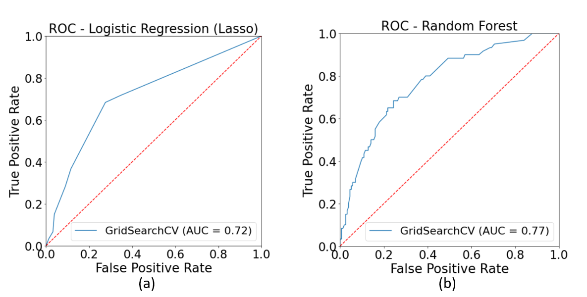

*Developing an Engagement Score and Identifying Churn Attributes for a Customer Success Platform*

Mahshid Mohammadi . Oct 18 2020 . 5 min read

---

This blog post is a summary of my project at the Insight Data Science Program which I completed over three weeks. I consulted for [ClientSuccess](https://www.clientsuccess.com), a small startup, which offers a **customer success platform for B2B SaaS companies**. Their platform empowers customer success managers (CSMs) to proactively manage post-sale customer relationships and renewals, measure customer health, and increase retention. Each of ClientSuccess’s customers represents an account and may have tens of users on their platform. 

ClientSuccess offers annual or multi-year contracts to their customers. Currently they use sign-ins as a proxy for engagement on their platform. They monitor their clients by tracking the days since last login or changes in the number of logins week over week and send alerts if engagement drops. I was asked to develop an engagement score that is deterministic of client churn at the upcoming renewal date. The data available to me was 3 months of usage data, from June to September 2020, and a few years of subscription records. 

 

## Developing a User Level Engagement Score
The first step for developing an engagement metric is to have a system that compares users and clients with each other and ranks them, in contrast to comparing users with their own previous status. Common choices for capturing engagement on a platform include days since last login, number of sign-ins, number of active days, number of specific events such as visiting a specific page or using specific features of the platform, and finally the time spent on the platform. For defining an engagement score it is important to understand how users are interacting with this specific platform. There is no one single metric that is a suitable choice for all platforms or services.

Generally, login based metrics are considered shallow as they do not reflect actual engagement on a platform. I calculated the time spent on the platform using user interactions; assuming a gap of 30 minutes or longer between a user’s consecutive interactions means the user was not active during that period. This is similar to Google Analytics’ approach for calculating time spent on a page. As shown in Figure 1, users with the same number of active days spent very different amounts of time on the platform. However, the time spent on the platform changes linearly with the number of pageviews and is a good indicator of user engagement. 

Figure 1: Time spent on the platform during a month vs. number of active days and pageviews 

Also, for this platform, event based engagement such as use of specific features of the platform are part of user’s adoption and must be captured in the adoption score. Therefore, I chose the time spent on the platform as the basis for the engagement score and defined the user level engagement score as the time spent on the platform over a 4 week sliding window (rolling sum) normalized by the 95th percentile. *But why 4 weeks and why normalize over the 95th percentile instead of the maximum?*

Selection of these types of parameters are crucial parts of metric development and have to be backed by data. The reason for normalization is to rank users based on a benchmark and that benchmark should not vary too much with time. However, as expected, the 100th percentile fluctuates a lot with time and reflects day to day variations caused by intense platform users, as shown in Figure 2. 

Figure 2: Rolling sum of the time spent on the platform over a 14 day and a 28 day sliding windows

I chose the 95th percentile since the difference between the 90th percentile and the 95th percentile in terms of time spent on the platform is large, as shown in Figure 3. Normalizing by the 90th percentile puts all users above the 90th percentile in the same bucket and gives them all an engagement score of 100/100. That may reduce our chances of identifying true power users and growth opportunities. Now that we have decided on the 95th percentile, we need to select a sliding window that results in a stable 95th percentile and that is equal to 4 weeks. Figure 4 represents the calculated engagement score for three users of the platform.

Figure 3: Choosing between 90th and 95th percentiles for normalization baseline and the duration of the sliding window

Figure 4: Sample engagement score for 3 platform users

## Developing an Account Level Engagement Score
SaaS products are built for accounts and a metric is only useful if it can be captured at an account level as well. For defining an account level engagement score we have to be mindful of the account segments. In our case, account segments are based on the value of the accounts which is correlated with the number of users. It wouldn’t be fair to compare a single user account with the ones that have tens of users. So I defined the account engagement score as the total time spent by all account users over a 4 week sliding window normalized by the 95th percentile of the account segment. Each account will have an engagement score based on their segment and their users will have individual scores based on how they stand among all the users of the platform. 

As I mentioned before, I only had access to 3 months of usage data and since the subscription terms are at least 1 year, it wasn’t possible for me to build a churn model with 3 months of usage data. During that period only a few companies had churned for which between a few days to a few weeks of usage data was available. I have provided an actionable plan for data collection and storage to allow a churn model to be built 9 months from now which would use my proposed engagement score as an input. Recurrent neural networks such as LSTM will be a good choice for this churn model that takes the time series of engagement scores as an input. It might be possible to derive additional features from the engagement score time series such as average, standard deviation, maximum, minimum, slope, etc. and build a churn model with simpler algorithms such as Random Forest and XGBoost. This aside, my proposed engagement score can be implemented immediately to monitor clients at user level and account level to identify at risk accounts and upselling opportunities.

 

## Building a Churn Model Using Customer PULSE 
Among the few years of subscription records that were available to me there was customer pulse survey data that included CSMs’ personal assessment of the issues or pain points that may hurt the health of the relationship. I decided to build a churn model using customer pulse data and identify the detrimental issues that played a role in their historical churn which is a valuable piece of information.

The Pulse records are classified into 12 main categories. I combined two of the categories due to their overlap and ambiguous definitions which reduced the number of features to 11. These features are binary and sparse. I used the data over the two renewal cohorts of 2018 and 2019, and built a logistic regression model with a 5-fold cross validation, lasso regularization, and hyperparameter tuning. Interpretability and the ability to handle sparse binary data made logistic regression my best choice. Data was split into train/test sets (0.7/0.3) in a stratified fashion as the data was imbalanced. 

Figure 5: ROC curve of the logistic regression model

The model achieved a recall of 68%, selected 3 features out of 11, and showed that client dynamics (lack of executive buy-in and resources) was the most detrimental factor in their historical churn. That insight gives CSMs an area to focus on to increase retention. My recommendation was to encourage customer success teams to own the renewal revenue and have a KPI tied to it. That will bring executives attention to the impact of customer success management and may encourage them to allocate more budget for it. 

 

## Added Business Value
* Developed an engagement score at user level and account level that can be implemented on the platform immediately that can be used to identify at-risk accounts and growth opportunities.
* Identified the most influential churn attributes by building a churn model using the customer pulse records that provides insight to increase retention.
* Recommended a new way to integrate NPS (Net Promoter Score) survey results into customer health score.
* Discovered data quality issues and made recommendations to remedy them. 

 

The end.

